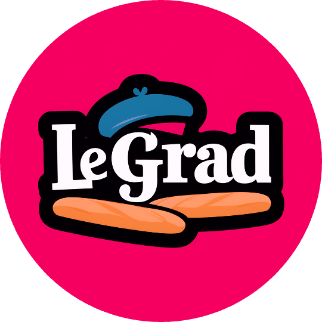

# LeGrad

<div align="center">

</div>

### [An Explainability Method for Vision Transformers via Feature Formation Sensitivity](https://arxiv.org/abs/2404.03214)
_[Walid Bousselham](http://walidbousselham.com/)<sup>1</sup>, [Angie Boggust](http://angieboggust.com/)<sup>2</sup>, [Sofian Chaybouti](https://scholar.google.com/citations?user=8tewdk4AAAAJ&hl)<sup>1</sup>, [Hendrik Strobelt](http://hendrik.strobelt.com/)<sup>3,4</sup> and [Hilde Kuehne](https://hildekuehne.github.io/)<sup>1,3</sup>_

<sup>1</sup> University of Bonn & Goethe University Frankfurt,
<sup>2</sup> MIT CSAIL,
<sup>3</sup> MIT-IBM Watson AI Lab,
<sup>4</sup> IBM Research.

[](https://huggingface.co/spaces/WalidBouss/LeGrad) 
<a href="https://arxiv.org/abs/2404.03214">"></a>
<a href="https://walidbousselham.com/LeGrad"></a>

Vision-Language foundation models have shown remarkable performance in various zero-shot settings such as image retrieval, classification, or captioning.
 we propose LeGrad, an explainability method specifically designed for ViTs. 
We LeGrad we explore how the decision-making process of such models by leveraging their feature formation process.
A by-product of understanding VL models decision-making is the ability to produce localised heatmap for any text prompt. 

The following is the code for a wrapper around the [OpenCLIP](https://github.com/mlfoundations/open_clip) library to equip VL models with LeGrad.

<div align="center">

</div>

## :hammer: Installation
`legrad` library can be simply installed via pip: 
```bash
$ pip install legrad_torch
```

## Demo
- Try out our web demo on [HuggingFace Spaces](https://huggingface.co/spaces) [](https://huggingface.co/spaces/WalidBouss/LeGrad)
- Run the demo on Google Colab: [](https://colab.research.google.com/drive/1ooB4AB9NRRe6Z-VilZizFOlFpTiKQHAc?usp=sharing)
- Run [`playground.py`](./playground.py) for a usage example.

To run the gradio app locally, first install gradio and then run [`app.py`](./app.py):
```bash
$ pip install gradio
$ python app.py
```
## Usage
To see which pretrained models is available use the following code snippet:
```python
import legrad
legrad.list_pretrained()
```

### Single Image
To process an image and a text prompt use the following code snippet:

**Note**: the wrapper does not affect the original model, hence all the functionalities of OpenCLIP models can be used seamlessly.
```python
import requests
from PIL import Image
import open_clip
import torch

from legrad import LeWrapper, LePreprocess
from utils import visualize

# ------- model's paramters -------
model_name = 'ViT-B-16'
pretrained = 'laion2b_s34b_b88k'
device = torch.device("cuda" if torch.cuda.is_available() else "cpu")
# ------- init model -------
model, _, preprocess = open_clip.create_model_and_transforms(
    model_name=model_name, pretrained=pretrained, device=device)
tokenizer = open_clip.get_tokenizer(model_name=model_name)
model.eval()
# ------- Equip the model with LeGrad -------
model = LeWrapper(model)
# ___ (Optional): Wrapper for Higher-Res input image ___
preprocess = LePreprocess(preprocess=preprocess, image_size=448)

# ------- init inputs: image + text -------
url = "http://images.cocodataset.org/val2017/000000039769.jpg"
image = preprocess(Image.open(requests.get(url, stream=True).raw)).unsqueeze(0).to(device)
text = tokenizer(['a photo of a cat']).to(device)

# -------
text_embedding = model.encode_text(text, normalize=True)
print(image.shape)
explainability_map = model.compute_legrad_clip(image=image, text_embedding=text_embedding)

# ___ (Optional): Visualize overlay of the image + heatmap ___
visualize(heatmaps=explainability_map, image=image)
```
 


# :star: Acknowledgement
This code is build as wrapper around [OpenCLIP](https://github.com/mlfoundations/open_clip) library from [LAION](https://laion.ai/), visit their repo for more vision-language models.
This project also takes inspiration from [Transformer-MM-Explainability](https://github.com/hila-chefer/Transformer-MM-Explainability) and the [timm library](https://github.com/huggingface/pytorch-image-models), please visit their repository.

# :books: Citation
If you find this repository useful, please consider citing our work :pencil: and giving a star :star2: :
```
@article{bousselham2024legrad,
  author    = {Bousselham, Walid and Boggust, Angie and Chaybouti, Sofian and Strobelt, Hendrik and Kuehne, Hilde}
  title     = {LeGrad: An Explainability Method for Vision Transformers via Feature Formation Sensitivity},
  journal   = {arXiv preprint arXiv:2404.03214},
  year      = {2024},
}
```
